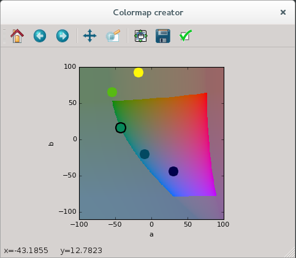

# Colormap editor

Interactive Lab points editor to create a quantitative colormap,
with linearly increasing lightness (L channel).

*Pierre Haessig - February 2015*

## Editor demo
Screenshot of the editor:

The **available sRGB gamut** is displayed for the point being moved (circled in black).
This gamut heavily depends on L value.

